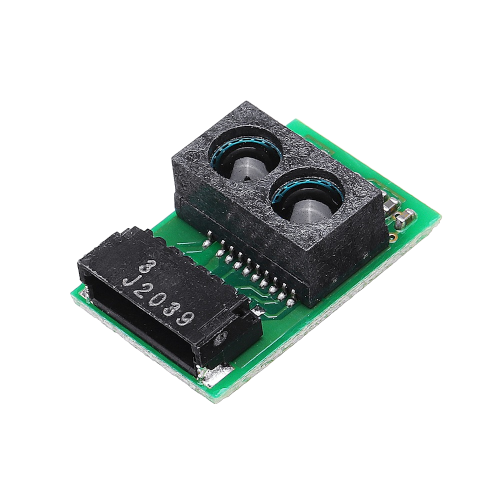

## GP2Y0E03 Library (C/C++)
* Library to use the GP2Y0E03 Distance Sensor from *Sharp*. (**Analog reading**)
   
|  |
| :-------------------------: |
| *GP2Y0E03 Distance Sensor*  |
   
## How to use ?   
* Include the library and call the constructor `GP2Y0E03`:
```C++
#include "GP2Y0E03.h"
 
GP2Y0E03 _sensor(A0); //Ex.: Analog Pin A0 on Arduino

void setup()
{
...
}
  
void loop()
{
...
_sensor.read() // Return the distance (cm) read by sensor
_sensor.detected() // Check if any obstacle was detected by sensor
...
}
```